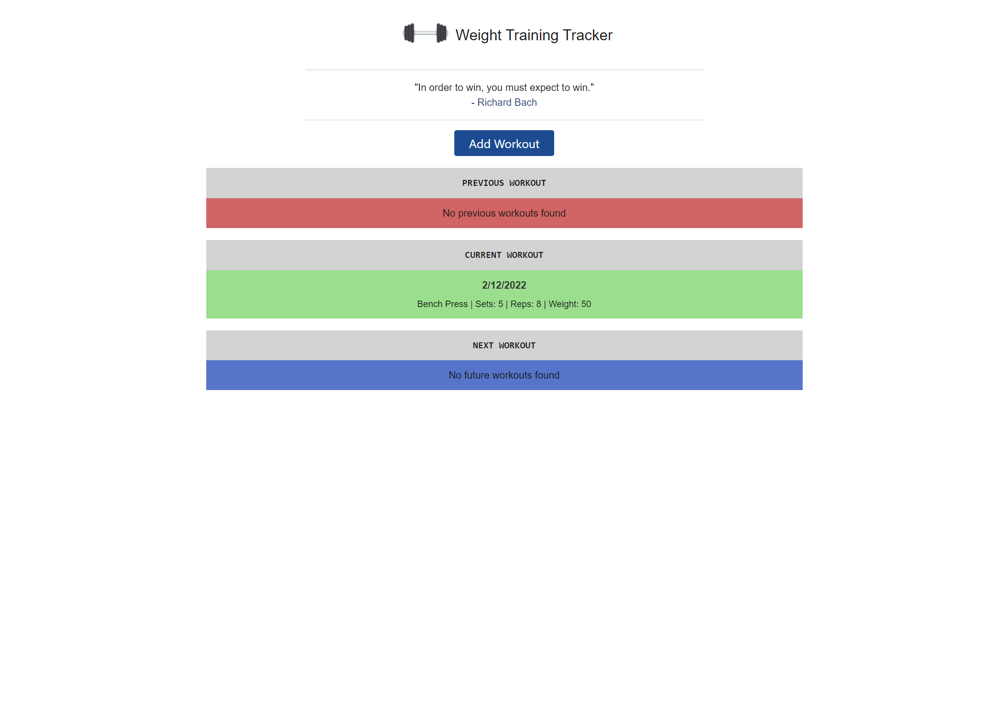

# weight-training-tracker

An interactive web application designed to assist in tracking/managing workouts over the course of a few days.
Allows user to populate app with workout days, as well as input exercises from a pre-generated list.
Allows user to create custom exercises and have them saved in local storage.

